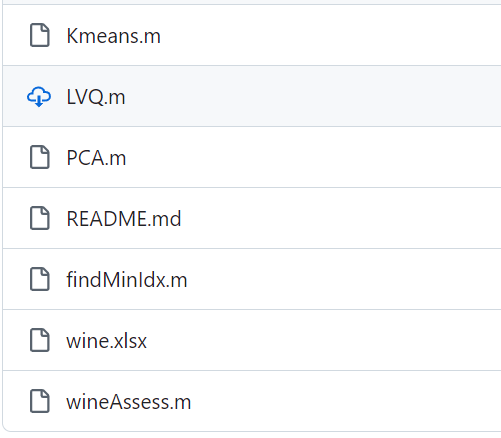

# Matlab Machine Learning UCI Wine Dataset Wine Classification and Origin Prediction Source Code

Machine Learning: Based on the UCI wine dataset, this project involves 178 sample data sets from three wine-producing regions, each containing a known label for the category and 13 chemical element content measurements. The goal is to train a model that can predict the origin of the wines produced from these samples.

The dataset is randomly divided into training and testing sets. A model capable of predicting the wine's origin based on its origin is trained using various methods such as PCA+Kmeans, PCA+LVQ, and BP neural networks. The accuracy rate of all models achieves around 95% in both training and testing.

Code Screenshot:
## Images

Here is a pay link on Stripe ( https://buy.stripe.com/3cs8yP7sY87d0vu9AB ). Please contact me lonlonago@foxmail.com after funding $89, and I will send you a complete data files , thank you!

